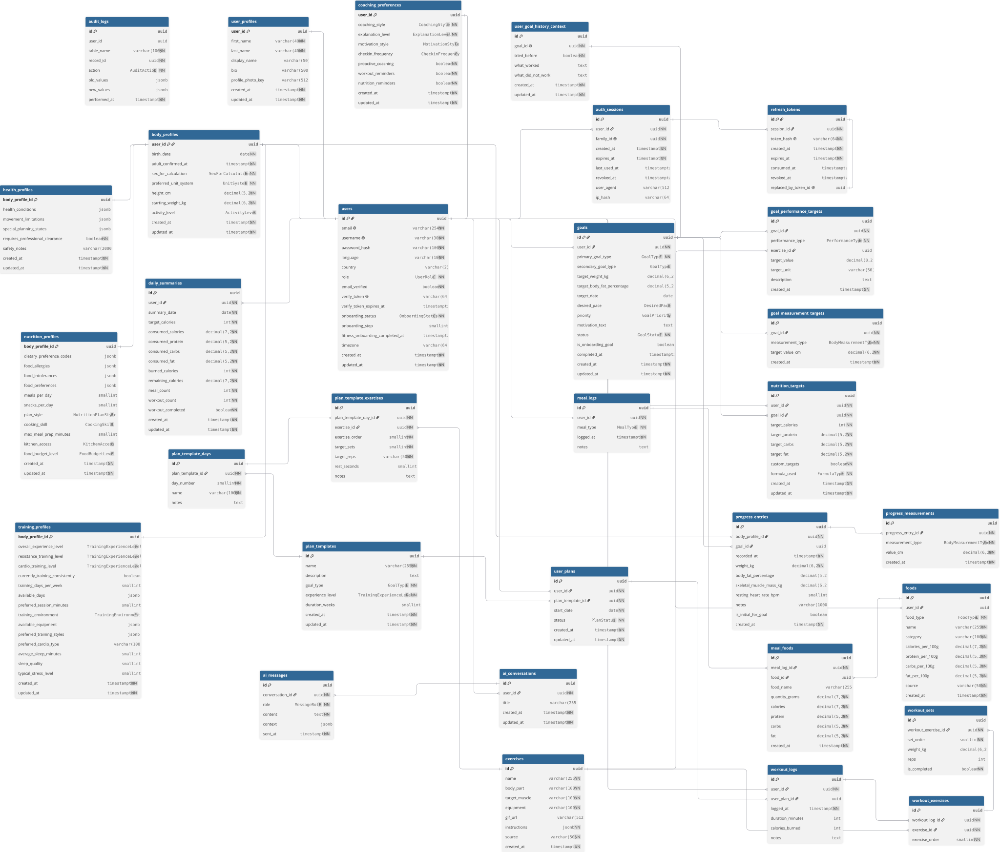

# Spotter Database

<p align="center">
  
</p>

<p align="center">
  <strong>Database architecture for the Spotter fitness tracking platform.</strong><br/>
  Built with PostgreSQL, designed for performance, and documented for collaboration.
</p>

---

## Table of Contents

- [Overview](#overview)
- [Tech Stack](#tech-stack)
- [Entity Relationship Diagram](#entity-relationship-diagram)
- [Schema Reference](#schema-reference)
  - [Auth and Identity](#group-1-auth--identity)
  - [User Profile and Body Data](#group-2-user-profile--body-data)
  - [Nutrition Targets](#group-3-nutrition-targets)
  - [Goals and Progress](#group-4-goals--progress)
  - [Reference Data](#group-5-reference-data-foods--exercises)
  - [Meal Tracking](#group-6-meal-tracking)
  - [Workout Tracking](#group-7-workout-tracking)
  - [Daily Summary](#group-8-daily-summary)
  - [AI Coach](#group-9-ai-coach)
  - [Audit Log](#group-10-audit-log)
- [Indexing Strategy](#indexing-strategy)
- [Database-Level Logic](#database-level-logic)
- [Data Sources and Seeding](#data-sources-and-seeding)

---

## Overview

Spotter is a fitness and nutrition tracking application with an integrated AI coach.
This repository contains the complete database layer: schema definitions, indexing
strategy, database-level logic (triggers, views), and seed data pipelines.

The database is designed to work alongside a Node.js/Express backend that uses
Prisma as its ORM for standard CRUD operations. Complex queries, performance
optimizations, and data integrity rules are handled at the database level using
raw SQL.

**Approach:** Hybrid (Prisma ORM for simple operations + Raw SQL for advanced logic).

## Tech Stack

| Component       | Technology                        |
|-----------------|-----------------------------------|
| Database        | PostgreSQL 16+                    |
| ORM             | Prisma (schema + basic CRUD)      |
| Advanced SQL    | Raw migrations (GIN, BRIN, Triggers) |
| Caching         | Redis (sessions, daily summary cache) |
| Search          | PostgreSQL Full-Text Search + pg_trgm |

---

## Entity Relationship Diagram

The full ERD covers 24 tables organized into 10 logical groups.

<p align="center">
  
</p>

---

## Schema Reference

Each table is documented with its columns, relationships, indexes, and design notes.

---

### GROUP 1: Auth & Identity

These tables are managed by the backend developer. They handle user registration,
email verification, session management, and token rotation.

---

#### `users`

The core account table. Every other table in the system references this one
directly or indirectly.

**Relationships:**
- One-to-One with `user_profiles`, `body_profiles`, `coaching_preferences`, `nutrition_targets`.
- One-to-Many with `auth_sessions`, `goals`, `meal_logs`, `workout_logs`, `daily_summaries`, `ai_conversations`.

**Columns:**

- `id` — UUID, primary key.
- `email` — VarChar(254), unique. Stored lowercase.
- `username` — VarChar(30), unique. Stored lowercase.
- `password_hash` — VarChar(100). Bcrypt hash, never the raw password.
- `language` — VarChar(10), default `'en'`.
- `country` — VarChar(2), optional. ISO 3166-1 alpha-2 code.
- `role` — Enum (USER, COACH, ADMIN), default USER.
- `email_verified` — Boolean, default false.
- `verify_token` — VarChar(64), optional. SHA-256 hex hash.
- `verify_token_expires_at` — Timestamptz, optional.
- `onboarding_status` — Enum (NOT_STARTED, IN_PROGRESS, COMPLETED).
- `onboarding_step` — SmallInt, optional. Null after completion.
- `fitness_onboarding_completed_at` — Timestamptz, optional.
- `timezone` — VarChar(64), optional. IANA timezone (e.g. "Africa/Cairo").
- `created_at` — Timestamptz.
- `updated_at` — Timestamptz.

---

#### `auth_sessions`

One authenticated login per device. Revoking a session invalidates its
entire token family.

**Relationship:** Many-to-One with `users` (CASCADE on delete).

**Columns:**

- `id` — UUID, primary key.
- `user_id` — UUID, references `users.id`.
- `family_id` — UUID, unique. Groups tokens into one rotation chain.
- `created_at` — Timestamptz.
- `expires_at` — Timestamptz.
- `last_used_at` — Timestamptz, optional.
- `revoked_at` — Timestamptz, optional. Set when session is invalidated.
- `user_agent` — VarChar(512), optional.
- `ip_hash` — VarChar(64), optional. SHA-256 of IP, never raw IP.

**Indexes:**

| Column       | Type   | Reason                              |
|--------------|--------|-------------------------------------|
| `user_id`    | B-Tree | Find all sessions for a user        |
| `expires_at` | B-Tree | Cleanup job finds expired sessions  |
| `revoked_at` | B-Tree | Filter out revoked sessions quickly |

---

#### `refresh_tokens`

Hashed opaque refresh tokens. Raw tokens are never stored in the database.
Supports token rotation with theft detection.

**Relationship:** Many-to-One with `auth_sessions` (CASCADE on delete).

**Columns:**

- `id` — UUID, primary key.
- `session_id` — UUID, references `auth_sessions.id`.
- `token_hash` — VarChar(64), unique. SHA-256 hex.
- `created_at` — Timestamptz.
- `expires_at` — Timestamptz.
- `consumed_at` — Timestamptz, optional. Set after successful rotation.
- `revoked_at` — Timestamptz, optional.
- `replaced_by_token_id` — UUID, unique, optional. Points to the replacement token.

**Indexes:**

| Column       | Type   | Reason                            |
|--------------|--------|-----------------------------------|
| `session_id` | B-Tree | Find all tokens for a session     |
| `expires_at` | B-Tree | Cleanup expired tokens            |
| `revoked_at` | B-Tree | Filter revoked tokens             |

---

### GROUP 2: User Profile & Body Data

These tables store the user's identity, physical attributes, health conditions,
dietary preferences, and training baseline. They are split by responsibility:
each table owns one domain.

---

#### `user_profiles`

Public display identity. This is the only table that could be shared with
other users in a future social feature. Private fitness and health data
must never be added here.

**Relationship:** One-to-One with `users` (CASCADE on delete).

**Columns:**

- `user_id` — UUID, primary key and foreign key.
- `first_name` — VarChar(40).
- `last_name` — VarChar(40).
- `display_name` — VarChar(50), optional.
- `bio` — VarChar(500), optional.
- `profile_photo_key` — VarChar(512), optional. Object storage key only.
- `created_at` — Timestamptz.
- `updated_at` — Timestamptz.

---

#### `body_profiles`

Private, stable physical facts used for calorie calculations and plan generation.
Current weight is not stored here; it lives in the latest `progress_entries` row.

**Relationships:**
- One-to-One with `users` (CASCADE on delete).
- One-to-One with `health_profiles`, `nutrition_profiles`, `training_profiles`.
- One-to-Many with `progress_entries`.

**Columns:**

- `user_id` — UUID, primary key and foreign key.
- `birth_date` — Date. Age is calculated at query time, never stored.
- `adult_confirmed_at` — Timestamptz. Audit proof of age confirmation.
- `sex_for_calculation` — Enum (MALE, FEMALE). For formulas only.
- `preferred_unit_system` — Enum (METRIC, IMPERIAL). Display preference.
- `height_cm` — Decimal(5,2). Always stored in metric.
- `starting_weight_kg` — Decimal(6,2). Immutable onboarding baseline.
- `activity_level` — Enum (SEDENTARY, LIGHTLY_ACTIVE, MODERATELY_ACTIVE, VERY_ACTIVE), optional.
- `created_at` — Timestamptz.
- `updated_at` — Timestamptz.

**Design Notes:**

The `starting_weight_kg` field is intentionally immutable. It preserves the
user's weight at the beginning of their journey. Current weight is always
derived from the most recent `progress_entries` row. This avoids data
duplication and ensures a single source of truth.

---

#### `health_profiles`

Private health and safety constraints. Uses JSONB for flexible storage of
conditions that vary widely between users.

**Relationship:** One-to-One with `body_profiles` (CASCADE on delete).

**Columns:**

- `body_profile_id` — UUID, primary key and foreign key.
- `health_conditions` — JSONB, optional.
- `movement_limitations` — JSONB, optional.
- `special_planning_states` — JSONB, optional.
- `requires_professional_clearance` — Boolean, default false.
- `safety_notes` — VarChar(2000), optional.
- `created_at` — Timestamptz.
- `updated_at` — Timestamptz.

**JSONB Structure — `health_conditions` example:**

```json
[
  { "code": "DIABETES", "notes": "Type 2", "active": true },
  { "code": "HYPERTENSION", "notes": "Controlled with medication", "active": true }
]
```

**JSONB Structure — `movement_limitations` example:**

```json
[
  { "bodyRegion": "RIGHT_KNEE", "trigger": "DEEP_SQUAT", "notes": "Pain below parallel" }
]
```

---

#### `nutrition_profiles`

Dietary preferences, allergies, intolerances, and practical constraints
like cooking skill and kitchen access.

**Relationship:** One-to-One with `body_profiles` (CASCADE on delete).

**Columns:**

- `body_profile_id` — UUID, primary key and foreign key.
- `dietary_preference_codes` — JSONB, optional. Array of codes (VEGAN, HALAL, etc.).
- `food_allergies` — JSONB, optional.
- `food_intolerances` — JSONB, optional.
- `food_preferences` — JSONB, optional.
- `meals_per_day` — SmallInt, optional.
- `snacks_per_day` — SmallInt, optional.
- `plan_style` — Enum (EXACT_MEALS, FLEXIBLE_MEALS, MACRO_BASED, SIMPLE_GUIDANCE), optional.
- `cooking_skill` — Enum (NONE, BASIC, INTERMEDIATE, ADVANCED), optional.
- `max_meal_prep_minutes` — SmallInt, optional.
- `kitchen_access` — Enum (NONE, MICROWAVE_ONLY, BASIC, FULL), optional.
- `food_budget_level` — Enum (LOW, MODERATE, FLEXIBLE), optional.
- `created_at` — Timestamptz.
- `updated_at` — Timestamptz.

---

#### `training_profiles`

Training experience, equipment availability, schedule, and recovery baseline.

**Relationship:** One-to-One with `body_profiles` (CASCADE on delete).

**Columns:**

- `body_profile_id` — UUID, primary key and foreign key.
- `overall_experience_level` — Enum (BEGINNER, INTERMEDIATE, ADVANCED), optional.
- `resistance_training_level` — Enum, optional.
- `cardio_training_level` — Enum, optional.
- `currently_training_consistently` — Boolean, optional.
- `training_days_per_week` — SmallInt, optional.
- `available_days` — JSONB, optional.
- `preferred_session_minutes` — SmallInt, optional.
- `training_environment` — Enum (COMMERCIAL_GYM, HOME_GYM, HOME_MINIMAL, OUTDOORS, MIXED), optional.
- `available_equipment` — JSONB, optional.
- `preferred_training_styles` — JSONB, optional.
- `preferred_cardio_type` — VarChar(100), optional.
- `average_sleep_minutes` — SmallInt, optional.
- `sleep_quality` — SmallInt, optional.
- `typical_stress_level` — SmallInt, optional.
- `created_at` — Timestamptz.
- `updated_at` — Timestamptz.

---

#### `coaching_preferences`

Controls how the AI coach communicates with each user.
Proactive behavior and reminders require explicit user opt-in.

**Relationship:** One-to-One with `users` (CASCADE on delete).

**Columns:**

- `user_id` — UUID, primary key and foreign key.
- `coaching_style` — Enum (SUPPORTIVE, BALANCED, DIRECT), default BALANCED.
- `explanation_level` — Enum (CONCISE, NORMAL, DETAILED), default NORMAL.
- `motivation_style` — Enum (ENCOURAGING, ACCOUNTABILITY, FACT_BASED, MINIMAL), optional.
- `checkin_frequency` — Enum (DAILY, FEW_TIMES_PER_WEEK, WEEKLY), optional.
- `proactive_coaching` — Boolean, default false.
- `workout_reminders` — Boolean, default false.
- `nutrition_reminders` — Boolean, default false.
- `created_at` — Timestamptz.
- `updated_at` — Timestamptz.

---

### GROUP 3: Nutrition Targets

---

#### `nutrition_targets`

Stores the user's daily calorie and macronutrient targets. These are
calculated automatically using the Mifflin-St Jeor equation, but the
user can override them manually.

**Relationship:** One-to-One with `users` (CASCADE on delete).

**Columns:**

- `user_id` — UUID, primary key and foreign key.
- `target_calories` — Int. Daily calorie goal.
- `target_protein` — Decimal(5,2). Grams per day.
- `target_carbs` — Decimal(5,2). Grams per day.
- `target_fat` — Decimal(5,2). Grams per day.
- `custom_targets` — Boolean, default false. When true, auto-recalculation is skipped.
- `formula_used` — Enum (MIFFLIN_ST_JEOR, HARRIS_BENEDICT, CUSTOM).
- `created_at` — Timestamptz.
- `updated_at` — Timestamptz.

**Sample Data:**

| user_id  | target_calories | target_protein | target_carbs | target_fat | custom_targets | formula_used    |
|----------|-----------------|----------------|--------------|------------|----------------|-----------------|
| a1b2...  | 2800            | 210.00         | 315.00       | 78.00      | false          | MIFFLIN_ST_JEOR |
| c3d4...  | 1850            | 130.00         | 210.00       | 55.00      | false          | MIFFLIN_ST_JEOR |
| e5f6...  | 3500            | 280.00         | 350.00       | 95.00      | true           | CUSTOM          |
| g7h8...  | 1550            | 100.00         | 180.00       | 45.00      | false          | MIFFLIN_ST_JEOR |

---

### GROUP 4: Goals & Progress

---

#### `goals`

Fitness goals with lifecycle tracking. Only one goal per user can be
active at any time, enforced at the database level.

**Relationship:** One-to-Many with `users` (CASCADE on delete).

**Columns:**

- `id` — UUID, primary key.
- `user_id` — UUID, references `users.id`.
- `goal_type` — Enum (LOSE_WEIGHT, MAINTAIN_WEIGHT, GAIN_WEIGHT, BUILD_MUSCLE, IMPROVE_FITNESS).
- `target_weight_kg` — Decimal(6,2), optional.
- `target_date` — Date, optional.
- `status` — Enum (DRAFT, ACTIVE, COMPLETED, CANCELLED), default DRAFT.
- `is_onboarding_goal` — Boolean, optional.
- `created_at` — Timestamptz.
- `updated_at` — Timestamptz.

**Indexes:**

| Column/Expression                           | Type                  | Reason                                    |
|---------------------------------------------|-----------------------|-------------------------------------------|
| `user_id`                                   | B-Tree                | Find all goals for a user                 |
| `(user_id, status)`                         | B-Tree (Composite)    | Filter active/completed goals per user    |
| `user_id WHERE status = 'ACTIVE'`           | B-Tree (Partial, Unique) | Enforce one active goal per user (Raw SQL) |

---

#### `progress_entries`

Body snapshots recorded over time. The most recent entry provides the
user's current weight. Linked to both `body_profiles` (owner) and
optionally to a `goal` (context).

**Relationships:**
- Many-to-One with `body_profiles` (CASCADE on delete).
- Many-to-One with `goals` (SET NULL on delete).
- One-to-Many with `progress_measurements`.

**Columns:**

- `id` — UUID, primary key.
- `body_profile_id` — UUID, references `body_profiles.user_id`.
- `goal_id` — UUID, optional. References `goals.id`.
- `recorded_at` — Timestamptz.
- `weight_kg` — Decimal(6,2). Main source of truth for current weight.
- `body_fat_percentage` — Decimal(5,2), optional.
- `skeletal_muscle_mass_kg` — Decimal(6,2), optional.
- `resting_heart_rate_bpm` — SmallInt, optional.
- `notes` — VarChar(1000), optional.
- `is_initial_for_goal` — Boolean, optional.
- `created_at` — Timestamptz.

**Indexes:**

| Column                            | Type               | Reason                                    |
|-----------------------------------|--------------------|-------------------------------------------|
| `(body_profile_id, recorded_at)`  | B-Tree (Composite) | Get latest weight or progress over time   |
| `goal_id`                         | B-Tree             | Find all entries for a specific goal      |

---

#### `progress_measurements`

Individual body circumference measurements attached to a progress entry.
All values are stored in centimeters regardless of the user's display preference.

**Relationship:** Many-to-One with `progress_entries` (CASCADE on delete).

**Columns:**

- `id` — UUID, primary key.
- `progress_entry_id` — UUID, references `progress_entries.id`.
- `measurement_type` — Enum (WAIST, CHEST, HIPS, NECK, SHOULDERS, LEFT_UPPER_ARM, RIGHT_UPPER_ARM, LEFT_FOREARM, RIGHT_FOREARM, LEFT_THIGH, RIGHT_THIGH, LEFT_CALF, RIGHT_CALF, ABDOMEN).
- `value_cm` — Decimal(6,2).
- `created_at` — Timestamptz.

**Indexes:**

| Column                                    | Type                  | Reason                                    |
|-------------------------------------------|-----------------------|-------------------------------------------|
| `progress_entry_id`                       | B-Tree                | Get all measurements for a check-in       |
| `(progress_entry_id, measurement_type)`   | B-Tree (Unique)       | One value per measurement type per entry  |

---

### GROUP 5: Reference Data (Foods & Exercises)

Standalone tables populated from external datasets. These are not tied to any
user and serve as lookup data for tracking.

---

#### `foods`

Nutritional information for food items. All values are per 100 grams.
Populated from the USDA FoodData Central (Foundation Foods) dataset.

**Relationship:** Referenced by `meal_foods`.

**Columns:**

- `id` — UUID, primary key.
- `name` — VarChar(255). The food name used for search.
- `category` — VarChar(100). Food group (Fruits, Vegetables, Meat, Dairy, etc.).
- `calories_per_100g` — Decimal(7,2).
- `protein_per_100g` — Decimal(5,2).
- `carbs_per_100g` — Decimal(5,2).
- `fat_per_100g` — Decimal(5,2).
- `source` — VarChar(50), default 'USDA'. Data origin.
- `created_at` — Timestamptz.

**Indexes:**

| Column/Expression        | Type             | Reason                                       |
|--------------------------|------------------|----------------------------------------------|
| `tsvector(name)`         | GIN              | Full-text search ("chicken" finds all types)  |
| `name` with pg_trgm      | GIN (Trigram)    | Typo-tolerant search ("chiken" finds "chicken") |
| `category`               | B-Tree           | Filter by food group                         |

**Sample Data:**

| name                         | category   | calories | protein | carbs  | fat   |
|------------------------------|------------|----------|---------|--------|-------|
| Chicken breast, raw          | Poultry    | 165.00   | 31.00   | 0.00   | 3.60  |
| Brown rice, cooked           | Grains     | 123.00   | 2.70    | 25.60  | 1.00  |
| Egg, whole, raw              | Dairy/Eggs | 143.00   | 12.60   | 0.70   | 9.50  |
| Banana, raw                  | Fruits     | 89.00    | 1.10    | 22.80  | 0.30  |

---

#### `exercises`

Exercise definitions with instructions and visual aids. Populated from
the hasaneyldrm/exercises-dataset (1,324 exercises).

**Relationship:** Referenced by `workout_exercises`.

**Columns:**

- `id` — UUID, primary key.
- `name` — VarChar(255). The exercise name used for search.
- `body_part` — VarChar(100). Target body area (Chest, Back, Legs, etc.).
- `target_muscle` — VarChar(100). Specific muscle (Pectorals, Lats, Quads).
- `equipment` — VarChar(100). Required equipment (Barbell, Dumbbell, Bodyweight).
- `gif_url` — VarChar(512), optional. URL to animated demonstration.
- `instructions` — JSONB. Array of step-by-step instructions.
- `source` — VarChar(50), default 'EXTERNAL'.
- `created_at` — Timestamptz.

**Indexes:**

| Column/Expression        | Type             | Reason                                         |
|--------------------------|------------------|-------------------------------------------------|
| `tsvector(name)`         | GIN              | Full-text search for exercises                  |
| `name` with pg_trgm      | GIN (Trigram)    | Typo-tolerant search                            |
| `body_part`              | B-Tree           | Filter by body part                             |
| `equipment`              | B-Tree           | Filter by equipment type                        |

**JSONB Structure — `instructions` example:**

```json
["Lie flat on a bench", "Grip the barbell slightly wider than shoulder width", "Lower the bar to your chest", "Press the bar back up to the starting position"]
```

---

### GROUP 6: Meal Tracking

---

#### `meal_logs`

A single meal event logged by the user. Connected to the specific
food items consumed through the `meal_foods` junction table.

**Relationship:** One-to-Many with `users` (CASCADE on delete).

**Columns:**

- `id` — UUID, primary key.
- `user_id` — UUID, references `users.id`.
- `meal_type` — Enum (BREAKFAST, LUNCH, DINNER, SNACK).
- `logged_at` — Timestamptz.
- `notes` — Text, optional.

**Indexes:**

| Column                  | Type               | Reason                            |
|-------------------------|--------------------|-----------------------------------|
| `(user_id, logged_at)`  | B-Tree (Composite) | "Show me today's meals"           |
| `logged_at`             | BRIN               | Time-series optimization (Raw SQL)|

---

#### `meal_foods`

Junction table linking meals to food items. Stores snapshot values
calculated at log time so that historical records remain accurate
even if food data is later updated.

**Relationships:**
- Many-to-One with `meal_logs` (CASCADE on delete).
- Many-to-One with `foods`.

**Columns:**

- `id` — UUID, primary key.
- `meal_log_id` — UUID, references `meal_logs.id`.
- `food_id` — UUID, references `foods.id`.
- `quantity_grams` — Decimal(7,2).
- `calories` — Decimal(7,2). Snapshot value.
- `protein` — Decimal(5,2). Snapshot value.
- `carbs` — Decimal(5,2). Snapshot value.
- `fat` — Decimal(5,2). Snapshot value.

**Indexes:**

| Column        | Type   | Reason                        |
|---------------|--------|-------------------------------|
| `meal_log_id` | B-Tree | Get all foods in a meal       |
| `food_id`     | B-Tree | Find which meals used a food  |

**Sample Data:**

| meal_log_id | food_id (name)     | quantity_grams | calories | protein | carbs  | fat  |
|-------------|--------------------|----------------|----------|---------|--------|------|
| m1...       | Chicken breast     | 200.00         | 330.00   | 62.00   | 0.00   | 7.20 |
| m1...       | Brown rice         | 150.00         | 184.50   | 4.05    | 38.40  | 1.50 |
| m2...       | Egg, whole         | 120.00         | 171.60   | 15.12   | 0.84   | 11.40|
| m2...       | Banana             | 100.00         | 89.00    | 1.10    | 22.80  | 0.30 |

---

### GROUP 7: Workout Tracking

---

#### `workout_logs`

A single workout session. Contains metadata about the entire session.
Individual exercises and their sets are stored in child tables.

**Relationship:** One-to-Many with `users` (CASCADE on delete).

**Columns:**

- `id` — UUID, primary key.
- `user_id` — UUID, references `users.id`.
- `logged_at` — Timestamptz.
- `duration_minutes` — Int, optional.
- `calories_burned` — Int, optional. User-reported (from smart watch or gym equipment).
- `notes` — Text, optional.

**Indexes:**

| Column                  | Type               | Reason                              |
|-------------------------|--------------------|-------------------------------------|
| `(user_id, logged_at)`  | B-Tree (Composite) | "Show me today's workouts"          |
| `logged_at`             | BRIN               | Time-series optimization (Raw SQL)  |

---

#### `workout_exercises`

An exercise performed within a workout session. Ordered by `exercise_order`.

**Relationships:**
- Many-to-One with `workout_logs` (CASCADE on delete).
- Many-to-One with `exercises`.

**Columns:**

- `id` — UUID, primary key.
- `workout_log_id` — UUID, references `workout_logs.id`.
- `exercise_id` — UUID, references `exercises.id`.
- `exercise_order` — SmallInt. Position in the workout.

**Indexes:**

| Column           | Type   | Reason                              |
|------------------|--------|-------------------------------------|
| `workout_log_id` | B-Tree | Get all exercises in a workout      |

---

#### `workout_sets`

A single set within an exercise. Tracks weight, repetitions, and completion status.

**Relationship:** Many-to-One with `workout_exercises` (CASCADE on delete).

**Columns:**

- `id` — UUID, primary key.
- `workout_exercise_id` — UUID, references `workout_exercises.id`.
- `set_order` — SmallInt. Position in the exercise.
- `weight_kg` — Decimal(6,2), optional.
- `reps` — Int, optional.
- `is_completed` — Boolean, default false.

**Indexes:**

| Column                | Type   | Reason                          |
|-----------------------|--------|---------------------------------|
| `workout_exercise_id` | B-Tree | Get all sets for an exercise    |

**Sample Data (Bench Press, 3 sets):**

| set_order | weight_kg | reps | is_completed |
|-----------|-----------|------|--------------|
| 1         | 60.00     | 12   | true         |
| 2         | 70.00     | 10   | true         |
| 3         | 80.00     | 8    | true         |

---

### GROUP 8: Daily Summary

---

#### `daily_summaries`

Pre-computed daily nutrition and workout summary. Updated automatically by
database triggers whenever meals or workouts are logged. This eliminates
the need for the backend to calculate these values on every request.

**Relationship:** One-to-Many with `users` (CASCADE on delete).

**Columns:**

- `id` — UUID, primary key.
- `user_id` — UUID, references `users.id`.
- `summary_date` — Date.
- `target_calories` — Int. Copied from `nutrition_targets`.
- `consumed_calories` — Decimal(7,2), default 0.
- `consumed_protein` — Decimal(5,2), default 0.
- `consumed_carbs` — Decimal(5,2), default 0.
- `consumed_fat` — Decimal(5,2), default 0.
- `burned_calories` — Int, default 0.
- `remaining_calories` — Decimal(7,2), default 0.
- `meal_count` — Int, default 0.
- `workout_count` — Int, default 0.
- `workout_completed` — Boolean, default false.

**Indexes:**

| Column                      | Type                  | Reason                              |
|-----------------------------|-----------------------|-------------------------------------|
| `(user_id, summary_date)`   | B-Tree (Unique)       | One summary per user per day        |
| `summary_date`              | BRIN                  | Time-series optimization (Raw SQL)  |

**Sample Data:**

| user_id | summary_date | target | consumed | burned | remaining | meals | workouts |
|---------|-------------|--------|----------|--------|-----------|-------|----------|
| a1b2... | 2026-08-31  | 2800   | 1840.00  | 350    | 1310.00   | 3     | 1        |
| c3d4... | 2026-08-31  | 1850   | 1620.00  | 0      | 230.00    | 2     | 0        |

---

### GROUP 9: AI Coach

---

#### `ai_conversations`

A conversation thread between the user and the AI coach.

**Relationship:** One-to-Many with `users` (CASCADE on delete).

**Columns:**

- `id` — UUID, primary key.
- `user_id` — UUID, references `users.id`.
- `title` — VarChar(255), optional. Can be auto-generated from the first message.
- `created_at` — Timestamptz.
- `updated_at` — Timestamptz.

**Indexes:**

| Column    | Type   | Reason                            |
|-----------|--------|-----------------------------------|
| `user_id` | B-Tree | Get all conversations for a user  |

---

#### `ai_messages`

Individual messages within a conversation. The `context` field stores a
JSONB snapshot of user data that was sent to the AI API alongside the
message, enabling auditing and debugging of AI responses.

**Relationship:** Many-to-One with `ai_conversations` (CASCADE on delete).

**Columns:**

- `id` — UUID, primary key.
- `conversation_id` — UUID, references `ai_conversations.id`.
- `role` — Enum (USER, ASSISTANT).
- `content` — Text. The message body.
- `context` — JSONB, optional. User data snapshot sent to the AI.
- `sent_at` — Timestamptz.

**Indexes:**

| Column                        | Type               | Reason                               |
|-------------------------------|--------------------|-----------------------------------------|
| `(conversation_id, sent_at)`  | B-Tree (Composite) | Load messages in chronological order  |

**JSONB Structure — `context` example:**

```json
{
  "weight_kg": 79.5,
  "goal": "LOSE_WEIGHT",
  "target_calories": 2800,
  "consumed_today": 1840,
  "burned_today": 350,
  "recent_meals": ["Chicken breast + Brown rice", "Banana"],
  "coaching_style": "BALANCED"
}
```

---

### GROUP 10: Audit Log

---

#### `audit_logs`

Immutable record of every significant data change. Populated automatically
by triggers on critical tables. Useful for debugging, security reviews,
and understanding data history.

**Columns:**

- `id` — UUID, primary key.
- `user_id` — UUID, optional. The user who caused the change.
- `table_name` — VarChar(100). Which table was modified.
- `record_id` — UUID. The primary key of the modified row.
- `action` — Enum (INSERT, UPDATE, DELETE).
- `old_values` — JSONB, optional. Previous state (for UPDATE and DELETE).
- `new_values` — JSONB, optional. New state (for INSERT and UPDATE).
- `performed_at` — Timestamptz.

**Indexes:**

| Column                      | Type               | Reason                                  |
|-----------------------------|--------------------|-----------------------------------------|
| `(table_name, record_id)`   | B-Tree (Composite) | Find all changes to a specific record   |
| `performed_at`              | B-Tree             | Filter by date range                    |

**Sample Data:**

| user_id | table_name        | action | old_values              | new_values              | performed_at         |
|---------|-------------------|--------|-------------------------|-------------------------|----------------------|
| a1b2... | nutrition_targets | UPDATE | {"target_calories":2650} | {"target_calories":2800} | 2026-08-31 10:15:00 |
| a1b2... | goals             | UPDATE | {"status":"ACTIVE"}      | {"status":"COMPLETED"}   | 2026-08-31 14:30:00 |

---

## Indexing Strategy

This database uses four types of indexes, each chosen for a specific use case:

### B-Tree (Default)

The standard PostgreSQL index. Used for equality checks, range queries, and sorting.
Applied to foreign keys, status columns, and composite lookups.

### BRIN (Block Range Index)

Extremely small indexes designed for columns where data is naturally ordered by
insertion time. Applied to `logged_at` and `summary_date` columns on tracking
tables. A BRIN index can be 100x smaller than an equivalent B-Tree while providing
comparable performance for time-range queries.

**Applied to:** `meal_logs.logged_at`, `workout_logs.logged_at`, `daily_summaries.summary_date`.

### GIN (Generalized Inverted Index)

Used for full-text search via `tsvector`. Enables natural language queries on
food and exercise names.

**Applied to:** `foods.name`, `exercises.name`.

### GIN with pg_trgm (Trigram)

An extension of GIN that enables fuzzy matching and typo tolerance. If a user
types "chiken" instead of "chicken", the database still finds the correct result.

**Applied to:** `foods.name`, `exercises.name`.

### Partial Unique Index

A conditional unique constraint that only applies to rows matching a filter.
Used to enforce the business rule that each user can have at most one active goal.

**Applied to:** `goals (user_id) WHERE status = 'ACTIVE'`.

---

## Database-Level Logic

These are SQL objects that live inside the database and execute automatically.
They are maintained as raw SQL migration files in the `sql/` directory.

### Triggers

| Trigger                     | Fires On                  | Action                                              |
|-----------------------------|---------------------------|-----------------------------------------------------|
| `trg_daily_summary_meal`    | INSERT/DELETE on `meal_foods` | Recalculates consumed calories and macros for the day |
| `trg_daily_summary_workout` | INSERT/DELETE on `workout_logs` | Updates burned calories and workout count for the day |
| `trg_audit_log`             | INSERT/UPDATE/DELETE on critical tables | Records the change in `audit_logs`        |

### Full-Text Search Setup

The `tsvector` columns and their associated triggers are created via raw SQL
to keep food and exercise search indexes updated automatically when new data
is inserted.

---

## Data Sources and Seeding

### Food Data

| Source                  | Dataset          | Records | Format | License     |
|-------------------------|------------------|---------|--------|-------------|
| USDA FoodData Central   | Foundation Foods | ~400    | CSV    | Public Domain |

Download: https://fdc.nal.usda.gov/download-datasets.html

The raw USDA data is multi-file and relational. A processing script reads the
CSV files, extracts the relevant columns (name, category, calories, protein,
carbs, fat per 100g), and inserts them into the `foods` table.

### Exercise Data

| Source                       | Records | Format | License    |
|------------------------------|---------|--------|------------|
| hasaneyldrm/exercises-dataset | 1,324   | JSON   | Open Source |

Download: https://github.com/hasaneyldrm/exercises-dataset

The dataset provides a single JSON file with exercise names, body parts,
target muscles, equipment, GIF URLs, and instructions. A processing script
parses the JSON and inserts the data into the `exercises` table.

---

## Project Structure

```
spotter-db/
├── README.md                   <- This file
├── docs/
│   ├── erd.svg                 <- Entity Relationship Diagram
│   └── spotter-mascot.png      <- Project mascot
├── schema/
│   └── schema.prisma           <- Prisma schema definition
├── sql/
│   ├── indexes.sql             <- GIN, BRIN, Partial Unique indexes
│   ├── triggers.sql            <- Daily summary and audit log triggers
│   ├── full_text_search.sql    <- tsvector and pg_trgm setup
│   └── seed.sql                <- Reference data insertion
└── data/
    ├── usda_foundation/        <- Raw USDA CSV files
    └── exercises/              <- Raw exercise JSON data
```
